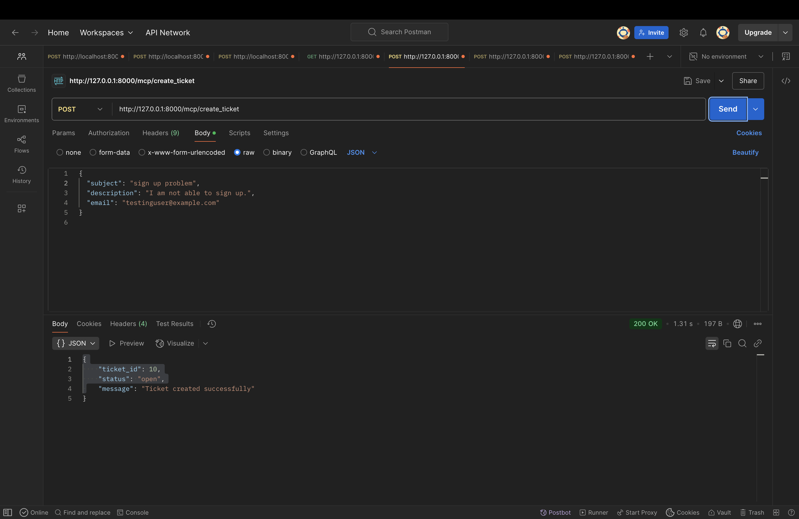
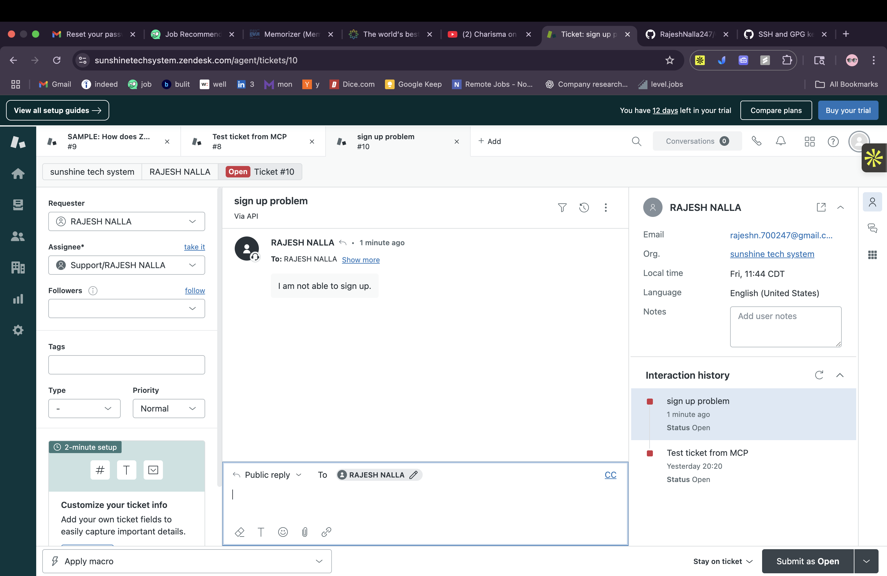
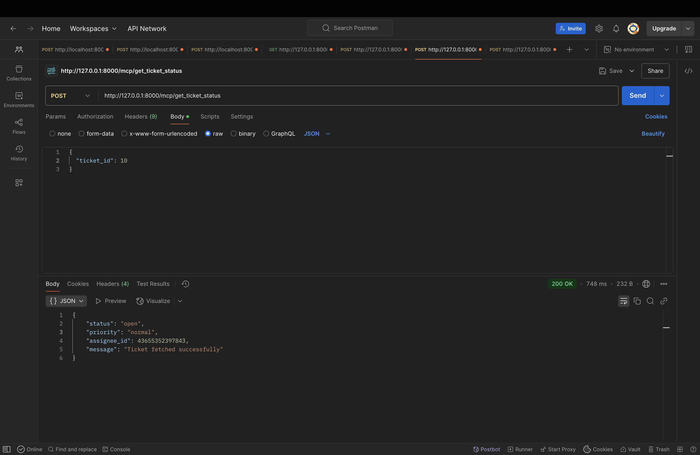
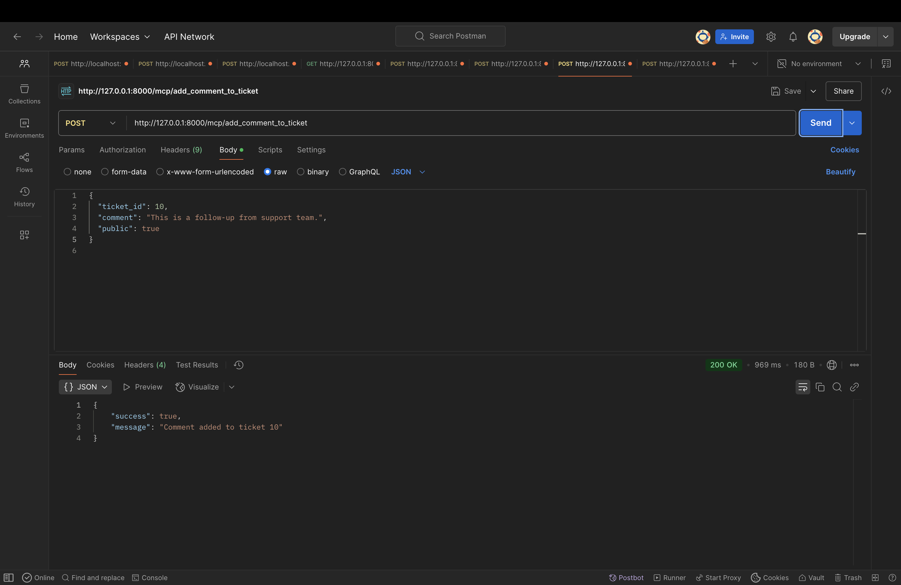
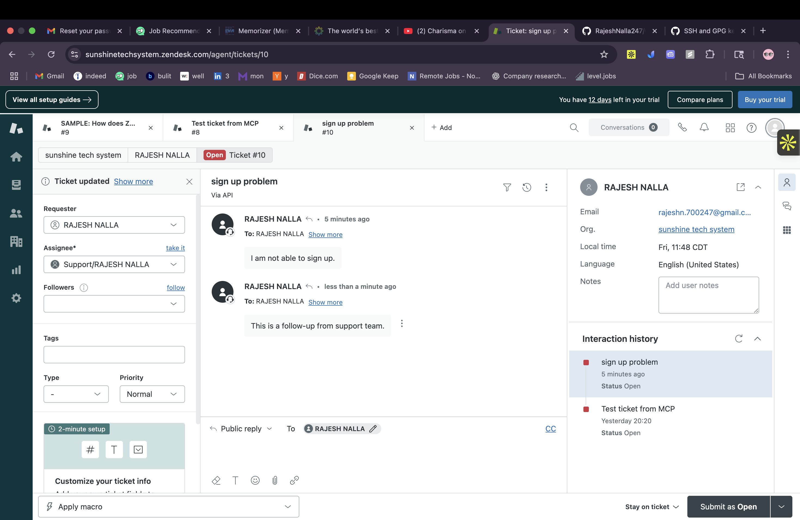

# Zendesk MCP Server

This project is a Model Context Protocol (MCP) compliant FastAPI server that integrates with the Zendesk Support API. It exposes atomic tools that allow AI agents or external systems to create, manage, and interact with Zendesk support tickets.


## 🚀Features

| Tool Name               | Description                                            | Endpoint                     |
| ----------------------- | ------------------------------------------------------ | ---------------------------- |
| `create_ticket`         | Creates a new support ticket in Zendesk                | `/mcp/create_ticket`         |
| `get_ticket_status`     | Fetches the status, priority, and assignee of a ticket | `/mcp/get_ticket_status`     |
| `list_recent_tickets`   | Lists recent Zendesk tickets with optional limit       | `/mcp/list_recent_tickets`   |
| `add_comment_to_ticket` | Adds a public or private comment to an existing ticket | `/mcp/add_comment_to_ticket` |

All tools are built with **MCP.2 protocol** and compatible with AI orchestration.


## 🧰 Tools Description & Postman Responses

### ✅ 1. `create_ticket`

Creates a new ticket using the user's email, subject, and description.

**Request**:

```json
{
  "subject": "Test ticket from MCP",
  "description": "This was created via MCP",
  "email": "testuser@example.com"
}
```

**Response (Postman)**:

```json
{
  "ticket_id": 123456,
  "status": "new",
  "message": "Ticket successfully created."
}
```

### ✅ 2. `get_ticket_status`

Fetches the current status, assignee, and priority of a given Zendesk ticket.

**Request**:

```json
{
  "ticket_id": 123456
}
```

**Response (Postman)**:

```json
{
  "status": "open",
  "priority": "normal",
  "assignee_id": 789123
}
```

--

### ✅ 3. `list_recent_tickets`

Lists recent tickets with an optional `limit` parameter (default is 5).

**Request**:

```json
{
  "limit": 3
}
```

**Response (Postman)**:

```json
{
  "tickets": [
    {
      "id": 12345,
      "subject": "Login issue",
      "status": "open",
      "created_at": "2025-08-06T14:32:00Z"
    },
    ...
  ]
}
```

---

### ✅ 4. `add_comment_to_ticket`

Adds a comment to an existing ticket. Can be public or internal.

**Request**:

```json
{
  "ticket_id": 123456,
  "comment": "We are looking into this.",
  "public": true
}
```

**Response (Postman)**:


```json
{
  "success": true,
  "message": "Comment added to ticket 123456"
}
```

---

## 🧱 Folder Structure

```
customer-service/
├── main.py
├── tools/
│   |
│   ├── create_ticket.py
│   ├── get_ticket_status.py
│   ├── list_recent_tickets.py
│   └── add_comment_to_ticket.py
├── .env
└── README.md
```

---

## 📦 Libraries Used

| Library         | Purpose                                      |
| --------------- | -------------------------------------------- |
| `fastapi`       | REST API server framework                    |
| `pydantic`      | Data validation for request/response models  |
| `requests`      | HTTP requests to Zendesk API                 |
| `python-dotenv` | Manage environment secrets via `.env` file   |
| `klavis-mcp`    | Register tools with MCP for AI compatibility |

---

## 🔐 .env Configuration

Create a `.env` file with:

```env
ZENDESK_EMAIL=email@company.com
ZENDESK_API_TOKEN==token_here
ZENDESK_SUBDOMAIN=companyname
```

> 🔒 Make sure Zendesk API token access is **enabled** in Admin Center.

---

## ▶️ Running the Server

1. Create virtual environment:

```bash
python -m venv .venv
source .venv/bin/activate
```

2. Install requirements:

```bash
pip install -r requirements.txt
```

3. Run server:

```bash
uvicorn main:app --reload
```

4. Test with Swagger UI:

```
http://localhost:8000/docs
```

---

## 📸 Postman Screenshots

```
- docs/postman_create_ticket.png
- docs/postman_status_check.png
- docs/postman_list_tickets.png
- docs/postman_add_comment.png
```


## ✅ Summary

This project delivers a powerful AI-compatible backend that lets you:

* Create support tickets in Zendesk
* Get current status and assignment of any ticket
* List recent open tickets
* Post updates or replies on active tickets
